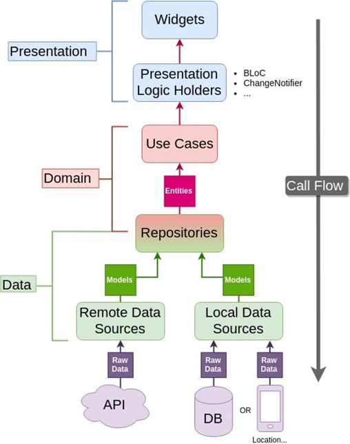
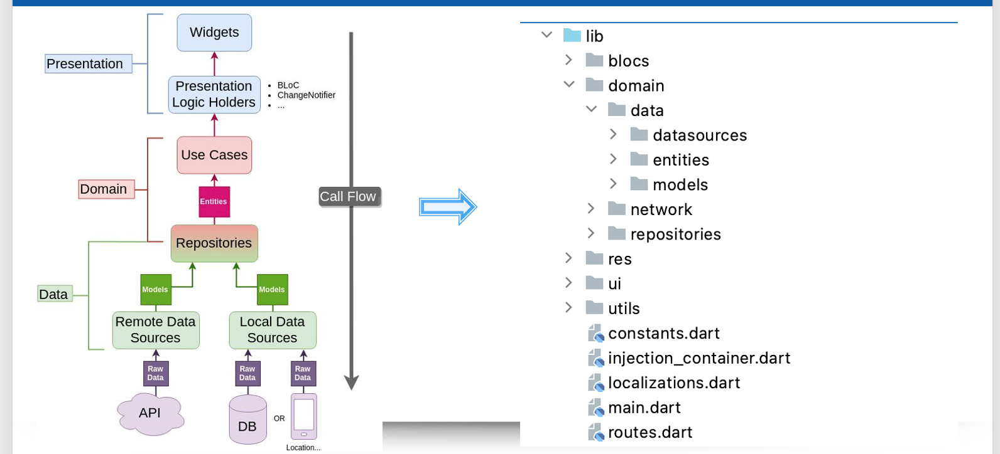
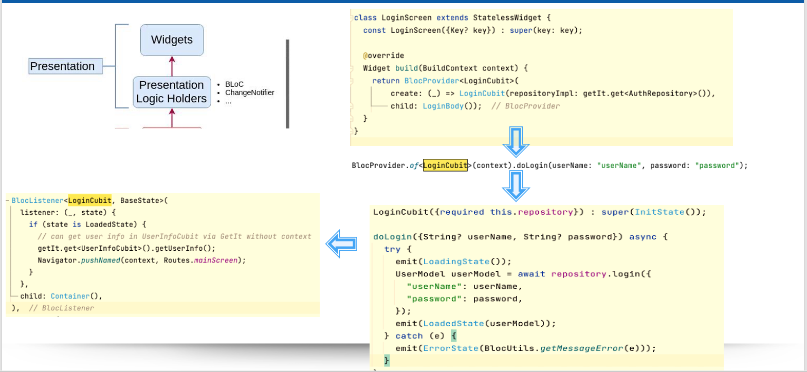
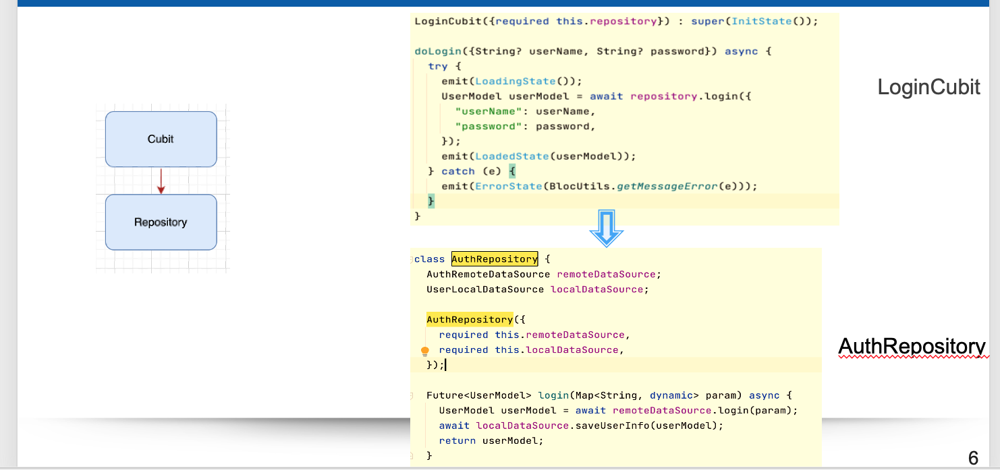
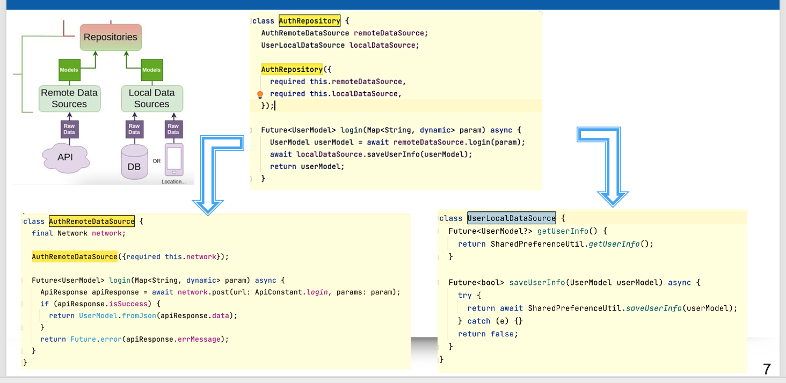
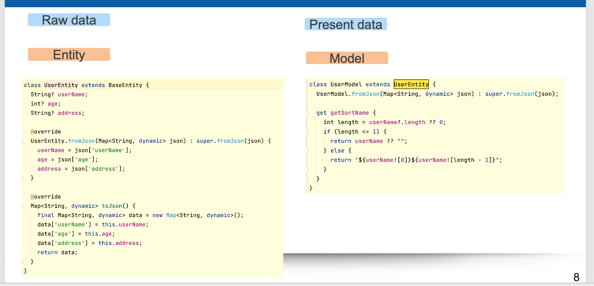

# Base Project Mobile Flutter

### A new Flutter flutter_template application.

## Getting Started For Beginners

This project is a starting point for a Flutter application.

A few resources to get you started if this is your first Flutter project:

- [Lab: Write your first Flutter app](https://flutter.dev/docs/get-started/codelab)
- [Cookbook: Useful Flutter samples](https://flutter.dev/docs/cookbook)

For help getting started with Flutter, view our
[online documentation](https://flutter.dev/docs), which offers tutorials, samples, guidance on mobile development, and a
full API reference.

## Overall structure

## Explanation & Project Organization

## 1) Presentation
Obviously need widgets to display something on the screen. These widgets then dispatch events to the Bloc and listen 
for states (or an equivalent if you don't use Bloc for state management).

## 2) Bloc - Repository

It will contain only the core business logic (use cases) and business objects (entities). It should be totally independent of every other layer.

## 3) Repository - Data Source

The data layer consists of a Repository implementation (the contract comes from the domain layer) and data sources - one is usually for getting remote (API) data and the other for caching that data. Repository is where you decide if you return fresh or cached data, when to cache it and so on.

## 4) Model - Entity
May notice that data sources don't return Entities but rather Models. The reason behind this is that transforming 
raw data (e.g JSON) into Dart objects requires some JSON conversion code.
You should use Entity classes responsible for converting data. And create Model classes which extend 
Entities and add some specific functionality (toJson, fromJson) or additional
fields, like database ID as Present data

Entity classes as raw data

Model classes as present data

